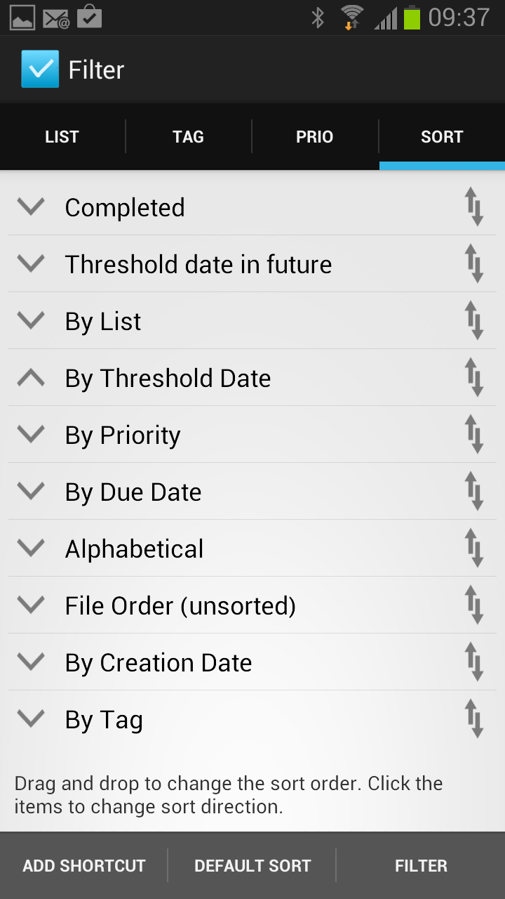

# Manage Your Now

Master Your Now (MYN) is an email and todo list management system developed by [Michael Linenberger](http://www.michaellinenberger.com/1MTDvsMYN.html). Its main characteristic is that it prevents you becoming overwhelmed by your tasklist by getting task that are not urgent out of the way and using technology to automatically get relevant task in your face again. The todo list management alone is also refered to as the One Minute To-Do List (1MTD).

Simpletask has (almost) all the building blocks to use it for MYN. (You can't hide future tasks but you can sort them to the end). This page describes how to configure Simpletask for MYN.

## Creating the contexts for MYN

MYN defines 3 urgency zones, we will map them to lists in Simpletask so that they sort correctly.

* Critical Now -> @CriticalNow
* Opportunity Now -> @OpportunityNow
* Over The Horizon -> @OverTheHorizon

Furthermore MYN defines a Significant Outcome (SOC) zone which needs to be at the top of you list. To achieve that, we map it to:

* Significant Outcome -> @!SOC

One disadvantage of Simpletask when using it for MYN is if a certain urgency zone is empty, you will have to retype the listname when creating a new item in that urgency zone. One workaround is to not archive all your tasks immediately so that there will always be tasks (though completed) on each list.

## Configuring the sort for MYN

To defer tasks in Simpletask for Defer-To-Do or Defer-To-Review we use the threshold date functionallity. So make sure in settings the `Defer by threshold date` is checked. You can then use threshold date `t:yyyy-mm-dd` as startdate in MTD

Even though we can't hide future tasks, we can sort them to the end. To achieve that we use the `Threshold date in future` sort.The other main thing is to sort your list by reversed threshold date so that older tasks will be sorted lower on the list. Besides that it doesn't really matter how you sort after that, see picture the below for an example.

## Using the list

When you are reviewing the items on your list and you want to defer one or more
tasks, you can select them and use the `defer` menu item in the overflow menu.
There are some prefilled options which you would use often in MTD or you can
defer to a specific date.
After defering the task it will move to the bottom of the listview if it has
been defered into the future and out of your face.

